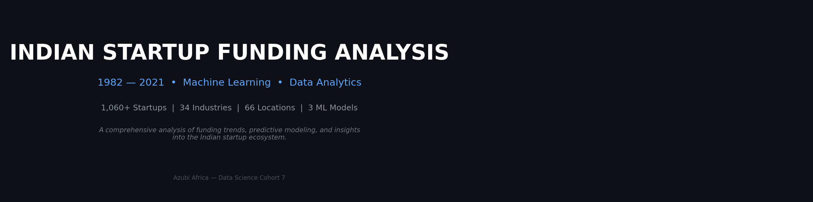
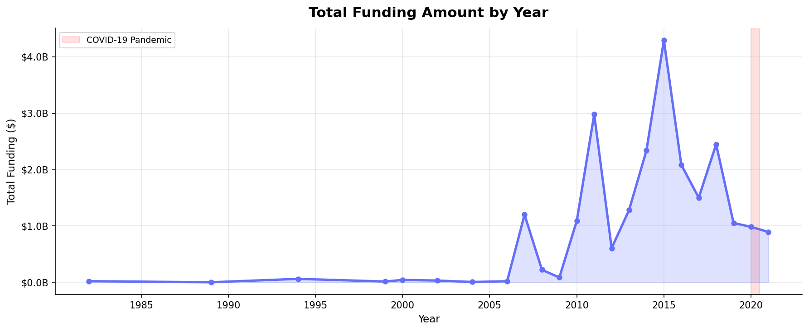
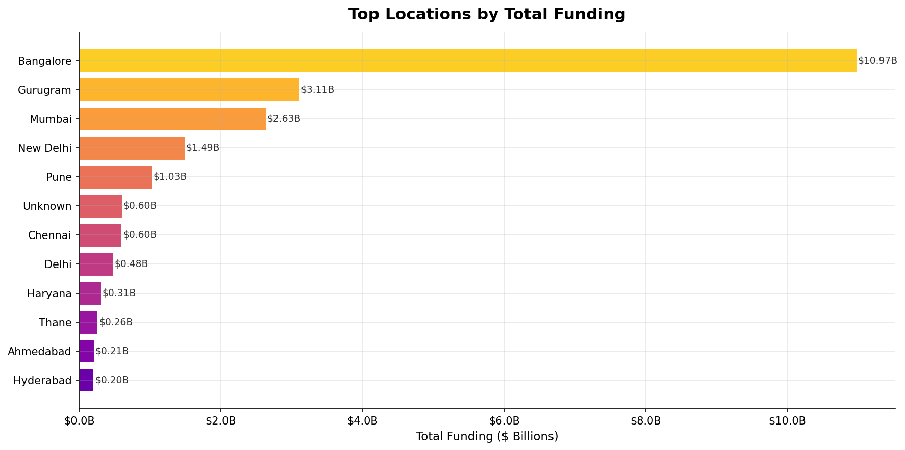
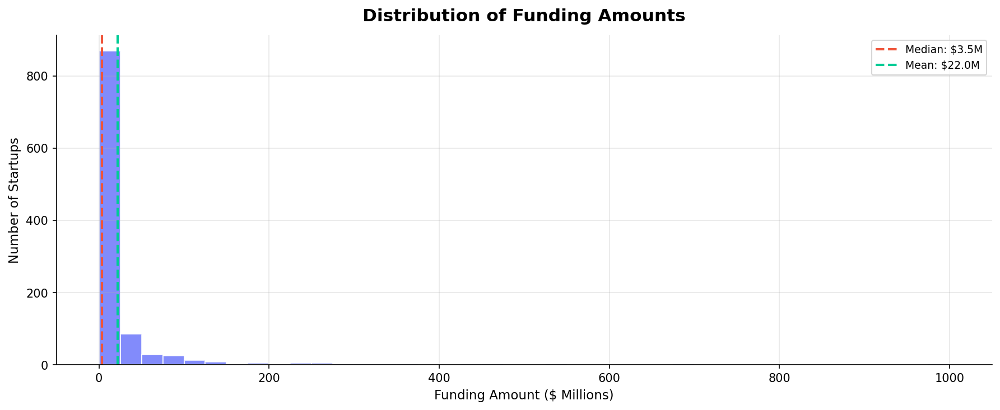
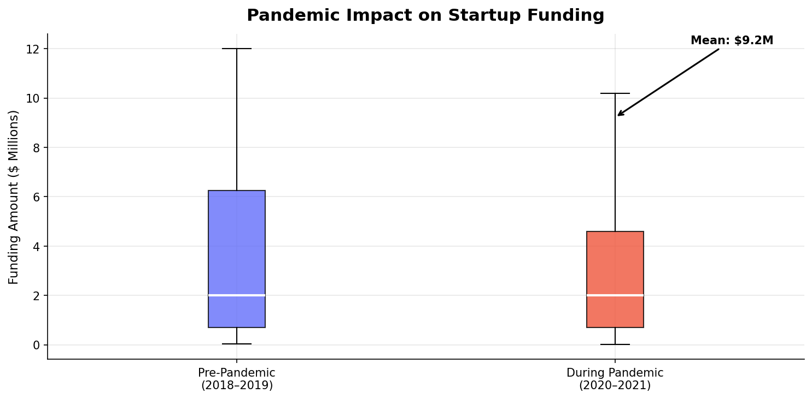
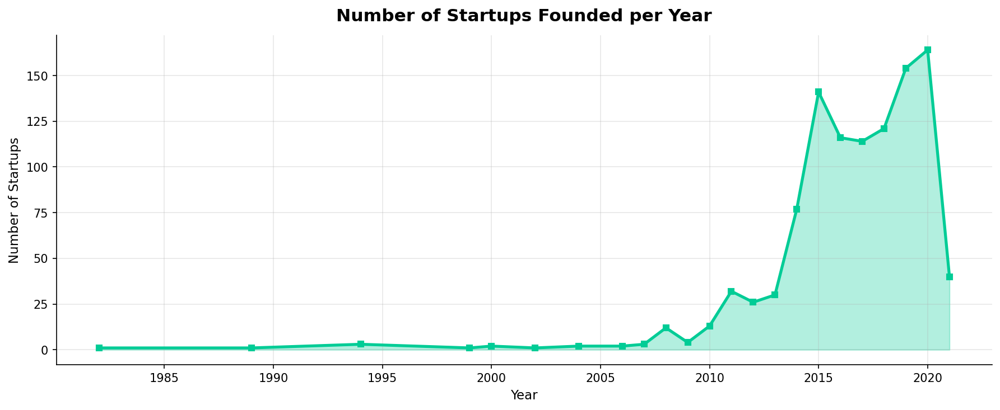
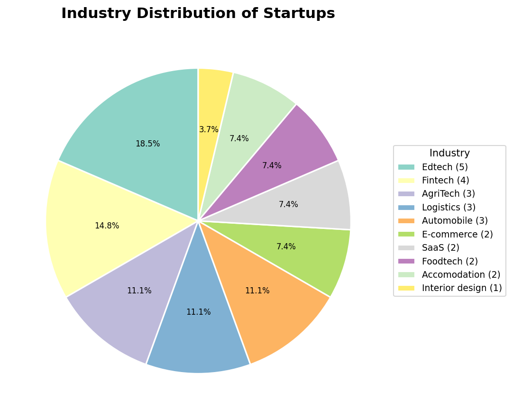

<div align="center">
  
</div>

<br>

<p align="center">
  <a href="#-project-overview">Overview</a> •
  <a href="#-features">Features</a> •
  <a href="#-tech-stack">Tech Stack</a> •
  <a href="#-installation">Installation</a> •
  <a href="#-usage">Usage</a> •
  <a href="#-ml-models">ML Models</a> •
  <a href="#-eda-highlights">EDA</a> •
  <a href="#-docker">Docker</a> •
  <a href="#-project-structure">Structure</a> •
  <a href="#-license">License</a>
</p>

---

## 📋 Project Overview

A comprehensive **data analytics and machine learning** project analyzing the Indian startup funding landscape from **1982 to 2021**. This project explores funding trends, builds predictive models for funding amounts and startup success, and provides an interactive web application for exploration and prediction.

Built as part of the **Azubi Africa Data Science Cohort 7** program.

| Metric | Value |
|--------|-------|
| Startups Analyzed | 1,060+ |
| Industries Covered | 34 |
| Locations | 66 |
| ML Models | 3 (Funding, Success, Industry) |
| Web App | Streamlit + Docker |

---

## ✨ Features

### 📊 Exploratory Data Analysis
- **Funding Trends** — Year-over-year funding analysis with COVID-19 impact assessment
- **Industry Analysis** — Top funded industries and sector distribution
- **Location Insights** — Geographic funding concentration across Indian cities
- **Statistical Testing** — ANOVA hypothesis testing on industry funding differences
- **Interactive Visualizations** — Plotly-powered dynamic charts in the web app

### 🤖 Machine Learning Models
| Model | Task | Algorithm | Tuning |
|-------|------|-----------|--------|
| **Funding Predictor** | Regression (funding $ amount) | Ridge, Random Forest, Gradient Boosting | GridSearchCV |
| **Success Predictor** | Classification (success/fail) | Random Forest, Logistic Regression, Gradient Boosting | GridSearchCV + SMOTE |
| **Industry Classifier** | Text classification | TF-IDF + Random Forest | GridSearchCV |

### 🌐 Interactive Web App
Built with **Streamlit** — explore data, make predictions, and ask questions via AI:

1. **Home** — Upload your own CSV or load the sample dataset
2. **EDA Explorer** — Interactive charts and pre-generated visualizations
3. **Funding Predictor** — Predict funding amount from startup features
4. **Success Predictor** — Estimate probability of startup success
5. **Industry Classifier** — Categorize companies by description
6. **AI Assistant** — Ask questions powered by Google Gemini

---

## 🛠 Tech Stack

| Category | Technologies |
|----------|-------------|
| **Languages** | Python 3.11 |
| **Data Processing** | Pandas, NumPy, Statsmodels |
| **Visualization** | Matplotlib, Seaborn, Plotly |
| **Machine Learning** | Scikit-learn, XGBoost, Imbalanced-learn |
| **Web App** | Streamlit |
| **AI/LLM** | Google Generative AI (Gemini) |
| **DevOps** | Docker, Docker Compose |
| **Environment** | Python-dotenv |

---

## 🚀 Installation

### Prerequisites
- Python 3.11+
- pip
- (Optional) Docker

### Local Setup

```bash
# Clone the repository
git clone https://github.com/ndumbe0/LP-1-Project.git
cd LP-1-Project

# Create virtual environment
python -m venv .venv

# Activate it
# Windows:
.venv\Scripts\activate
# Linux/Mac:
source .venv/bin/activate

# Install dependencies
pip install -r requirements.txt

# Run EDA and train models
python eda_cleaning.py
python train_models.py

# Launch the web app
streamlit run app.py
```

### AI Assistant Setup
For the AI Assistant page to work:
1. Get a [Google AI Studio API key](https://aistudio.google.com/apikey)
2. Create a `.env` file in the project root:
   ```
   GOOGLE_AI_API_KEY=your_api_key_here
   ```

---

## 🐳 Docker

```bash
# Build and run
docker-compose up --build

# Access at http://localhost:8501

# Or manually:
docker build -t startup-funding-analysis .
docker run -p 8501:8501 -e GOOGLE_AI_API_KEY=your_key startup-funding-analysis
```

The Docker image runs EDA + model training during build and serves the Streamlit app on port 8501.

---

## 🧠 ML Models

### Funding Amount Predictor
- **Target**: `Amount in ($)` — continuous regression
- **Algorithms**: Linear Regression, Ridge, Random Forest, Gradient Boosting
- **Best Model**: Ridge (R² ≈ 0.095)
- **Tuning**: GridSearchCV with 5-fold cross-validation
- **Note**: Limited predictive power due to sparse feature set; improves on baseline (original R² = 0.0119)

### Startup Success Predictor
- **Target**: Binary classification (funding > median = success)
- **Algorithm**: Random Forest (best after tuning)
- **Performance**: ~64% accuracy, F1 ≈ 0.61
- **Tuning**: GridSearchCV over n_estimators, max_depth, min_samples_split
- **Balancing**: SMOTE oversampling applied

### Industry Classifier
- **Target**: Industry category from company description text
- **Pipeline**: TF-IDF Vectorizer → Random Forest Classifier
- **Tuning**: GridSearchCV over ngram_range, max_features, and RF params

---

## 📈 EDA Highlights

<div align="center">
  
  <p><em>Total funding amount by year — significant growth from 2014, with COVID-19 impact highlighted</em></p>
</div>

<br>

<div align="center">
  
  <p><em>Bangalore dominates with over $10B in total funding; Mumbai and Gurugram follow</em></p>
</div>

<br>

<div align="center">
  
  <p><em>Right-skewed distribution — most startups raise under $10M, with a long tail of larger rounds</em></p>
</div>

<br>

<div align="center">
  
  <p><em>Funding levels remained resilient during COVID-19 (2020–2021) compared to pre-pandemic years</em></p>
</div>

<br>

<div align="center">
  
  <p><em>Startup formation surged from 2014 onward, peaking in 2020 with 164 new startups</em></p>
</div>

<br>

<div align="center">
  
  <p><em>Industry distribution among known-sector startups — Edtech, Fintech, and AgriTech lead</em></p>
</div>

### Key Findings

1. **💰 Bangalore** accounts for the highest concentration of startup funding (~$10B+)
2. **📈 2014** marked an inflection point with exponential growth in startup funding
3. **🦠 COVID-19** did not crash funding — 2020 levels remained comparable to 2018–2019
4. **🧪 Statistical Testing**: ANOVA confirms significant differences in average funding across industries
5. **🏆 Gaming & Social Media** received the highest average funding amounts

---

## 📁 Project Structure

```
LP-1-Project/
├── app.py                    # Streamlit multipage web application
├── eda_cleaning.py           # EDA and data cleaning pipeline
├── train_models.py           # ML model training with GridSearchCV
├── generate_images.py        # README visualization generation
├── requirements.txt          # Python dependencies
├── Dockerfile                # Docker image definition
├── docker-compose.yml        # Multi-service Docker configuration
├── .gitignore                # Git ignore rules
├── .env                      # Environment variables (not tracked)
│
├── data/
│   ├── startup_funding_clean.csv   # Cleaned merged dataset
│   ├── dbo.LP1_startup_funding2020.csv
│   ├── dbo.LP1_startup_funding2021.csv
│   ├── startup_funding2019.csv
│   └── startup_funding2018.csv
│
├── models/
│   ├── funding_pipeline.pkl   # Best funding regression model
│   ├── success_pipeline.pkl   # Best success classifier
│   └── industry_pipeline.pkl  # Industry text classifier
│
├── images/
│   ├── cover.png              # README banner
│   ├── funding_trend.png      # Funding by year chart
│   ├── top_locations_funding.png
│   ├── funding_distribution.png
│   ├── pandemic_impact.png
│   ├── startups_per_year.png
│   └── industry_pie.png
│
└── __pycache__/
```

---

## 📝 License

This project is developed for educational purposes as part of the **Azubi Africa Data Science Cohort 7** program.

---

<div align="center">
  <p>
    <b>Project Owner:</b> Moses N. Ndumbe (<a href="mailto:ndumbemoses@gmail.com">ndumbemoses@gmail.com</a>)<br>
    <b>Team Lead:</b> Ms. Portia Bentum (<a href="mailto:portia.bentum@azubiafrica.org">portia.bentum@azubiafrica.org</a>)
  </p>
  <p>
    <a href="https://dev.to/ndumbe0/my-first-data-analysis-project-4hm3">📖 Blog Post</a> •
    <a href="https://github.com/ndumbe0/LP-1-Project">📦 GitHub</a> •
    <a href="https://www.azubiafrica.org/data-analytics">🎓 Azubi Africa</a>
  </p>
</div>
