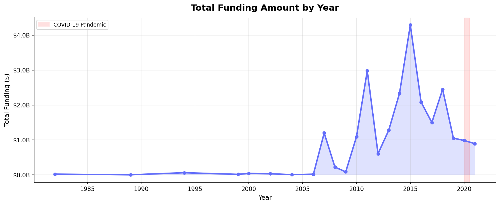
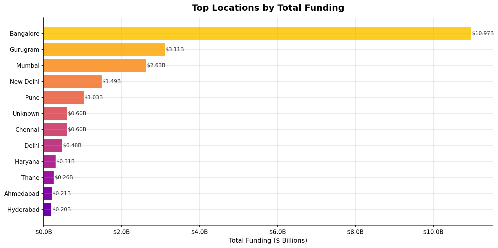
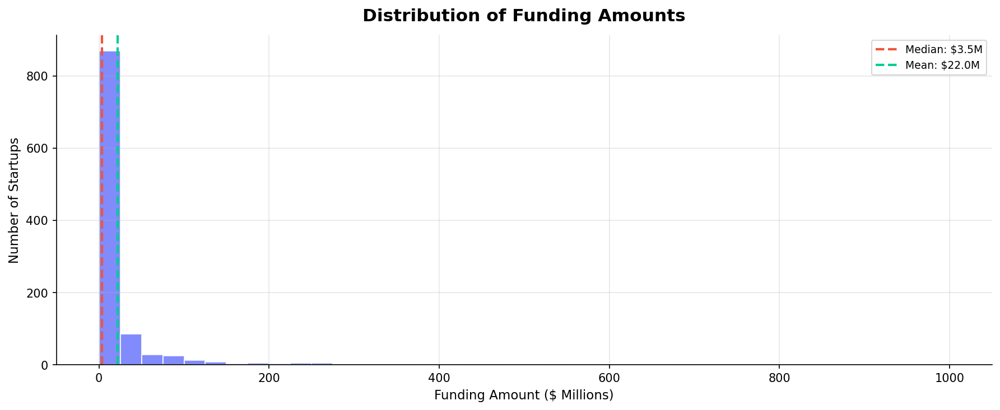
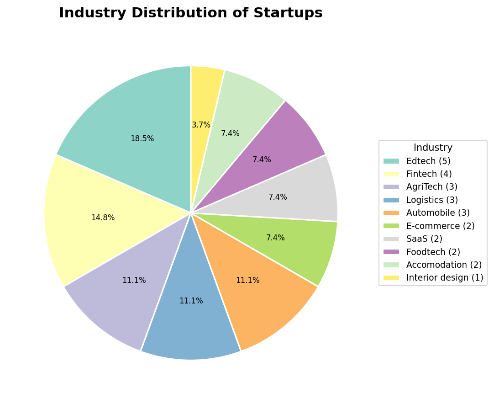
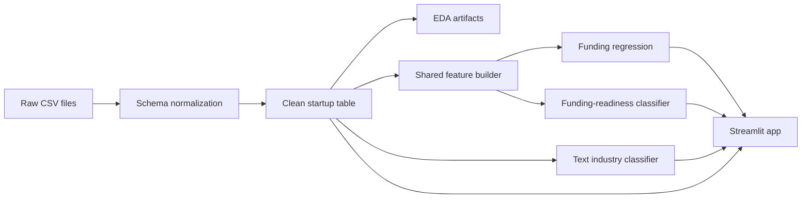

# Startup Funding Analyzer


Startup Funding Analyzer is a data science project for exploring Indian startup funding activity and scoring new startup concepts against similar historical companies. It combines a cleaned multi-year dataset, repeatable model training, an interactive Streamlit app, Docker support, and repository security checks.

## What It Does

- Cleans startup funding datasets from 2018-2021 into one canonical table.
- Preserves both funding year and founded year, with an explicit flag when founded year is inferred.
- Trains three model bundles: funding amount regression, funding-readiness classification, and industry classification from text.
- Lets users score a startup idea and compare it with similar funded startups.
- Supports batch CSV prediction for multiple startup concepts.
- Ships with tests, CI, Dependabot, CodeQL, Bandit, and `pip-audit` configuration.

## App Preview

| Funding trend | Startup hubs |
| --- | --- |
|  |  |

| Funding distribution | Industry mix |
| --- | --- |
|  |  |

## Repository Layout

```text
.
├── app.py                         # Streamlit app
├── eda_cleaning.py                # Data cleaning and visualization entrypoint
├── train_models.py                # Model training entrypoint
├── startup_funding/               # Reusable Python package
│   ├── data.py                    # Schema mapping, cleaning, derived CSVs
│   ├── features.py                # Shared feature engineering
│   ├── training.py                # Model training and evaluation
│   ├── prediction.py              # App and batch prediction helpers
│   └── model_io.py                # Model hash verification
├── tests/                         # Unit tests for cleaning and prediction pipelines
├── data/                          # Raw, clean, split, and summary CSV files
├── images/                        # README and app visuals
├── models/                        # Trained model bundles plus SHA256 files
├── .github/workflows/             # CI and CodeQL
├── .github/dependabot.yml         # Dependency update schedule
├── Dockerfile
└── docker-compose.yml
```

## Pipeline


```mermaid
flowchart LR
    A["Raw CSV files"] --> B["Schema normalization"]
    B --> C["Clean startup table"]
    C --> D["EDA artifacts"]
    C --> E["Shared feature builder"]
    E --> F["Funding regression"]
    E --> G["Funding-readiness classifier"]
    C --> H["Text industry classifier"]
    F --> I["Streamlit app"]
    G --> I
    H --> I
    C --> I
```

## Model Summary

The latest local training run writes detailed metrics to [`training_results.json`](training_results.json). The app reads the same file for its scorecards.

| Model | Target | Main use |
| --- | --- | --- |
| Funding regression | Estimated funding amount in USD | Forecast likely funding range for a startup profile |
| Funding-readiness classifier | Above-median funding probability | Show whether a concept resembles historically better-funded startups |
| Industry classifier | Industry label from company description | Compare stated industry with text-inferred industry |

The models are decision-support tools, not investment advice. The dataset is relatively small and covers a specific market/time window, so results should be interpreted as directional signals.

## Quickstart

```bash
python -m venv .venv
source .venv/bin/activate
python -m pip install --upgrade pip
python -m pip install -r requirements.txt -r requirements-dev.txt

python eda_cleaning.py
python train_models.py
python -m pytest
streamlit run app.py
```

On Windows PowerShell, activate the environment with:

```powershell
.venv\Scripts\Activate.ps1
```

## Docker

```bash
docker compose up --build
```

Open `http://localhost:8501`. The container regenerates clean data and models at build time, runs as a non-root user, and exposes Streamlit on port `8501`.

## Deploying on Render

This is a Streamlit app, not a gunicorn/WSGI app, so Render's Python
auto-detect fails with *"app.py does not export a top-level app"*. The
included [`render.yaml`](render.yaml) blueprint fixes that.

1. Push this repo to GitHub and in Render choose **New → Blueprint**.
2. Render reads `render.yaml` automatically (build: `pip install -r
   requirements.txt`, start: `streamlit run app.py --server.port=$PORT`).
3. In the service's Environment tab set `GOOGLE_AI_API_KEY` (only needed for
   the AI assistant page).

Alternatively deploy as a **Docker** service using the repo `Dockerfile`.

### Vercel (API only)

`api/index.py` exposes the same predictors as a FastAPI serverless app
(`GET /health`, `POST /predict/startup`, `POST /classify/industry`) — import
this repo in Vercel and it deploys automatically via `vercel.json`. Set
`API_KEY` in Vercel to require the `X-API-Key` header. The Streamlit UI
cannot run on Vercel; deploy it with the Render blueprint above.

## Optional Gemini Assistant

The core app does not require an API key. To enable the assistant page:

```bash
cp .env.example .env
```

Then add:

```text
GOOGLE_AI_API_KEY=your_key_here
```

Never commit `.env`.

## Data Quality Notes

- Source schemas differ by year; the cleaner maps aliases such as `Company_Name`, `Company/Brand`, `Sector`, `Industry`, `What_it_does`, and `Round/Series`.
- 2018 rows do not include founded year in the raw file, so the cleaner uses funding year as a conservative fallback and sets `Founded Imputed = true`.
- Uploaded CSV values are sanitized to reduce spreadsheet formula injection risk.
- Derived CSVs are written with stable LF line endings to keep diffs readable.

## Security And Quality

- CI runs Ruff, Pytest, import smoke tests, and `pip-audit`.
- CodeQL is configured for Python code scanning.
- Dependabot monitors Python requirements and GitHub Actions.
- Model artifacts are verified with SHA256 hash files before loading.
- The Streamlit app loads secrets only from local environment variables.
- See [`SECURITY.md`](SECURITY.md) for vulnerability reporting guidance.

## Milestones

| Status | Milestone | Notes |
| --- | --- | --- |
| Done | Canonical data pipeline | Raw yearly files map into one clean dataset |
| Done | Production app | Manual and batch prediction flows are available |
| Done | Model artifact integrity | SHA256 verification protects loaded model bundles |
| Done | CI and security automation | Tests, CodeQL, Dependabot, Bandit, and dependency audit are configured |
| Next | Deployment | Publish the Streamlit app or Docker image after remote checks pass |

## License

This project is released under the MIT License. See [`LICENSE`](LICENSE).
