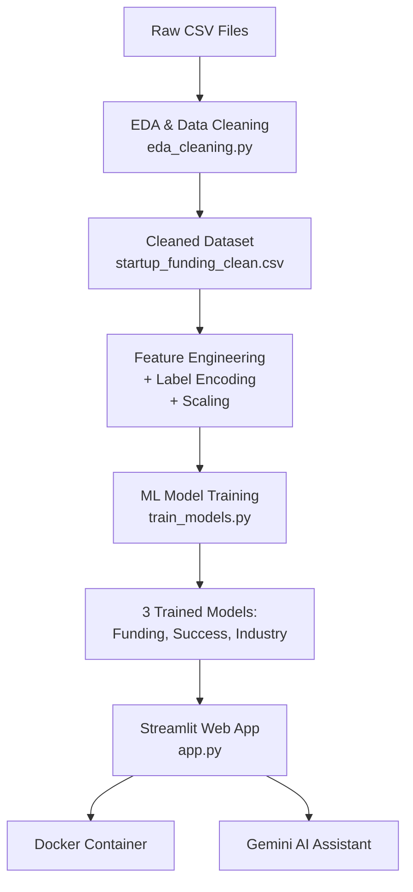

# 🚀 Startup Funding Analyzer


> **Short Summary:** An end-to-end machine learning pipeline and web application that analyzes Indian startup funding data (1982–2021), builds predictive models for funding amounts and startup success, classifies industries from company descriptions, and provides an interactive Streamlit dashboard with an AI-powered Gemini assistant.

---

## 📌 Executive Summary & Business Impact

* **The Problem:** Startup investors and founders lack a centralized, data-driven tool to understand funding trends, predict funding outcomes, and classify company industries from unstructured text across the Indian startup ecosystem.
* **The Solution:** A full-stack Streamlit application backed by three machine learning models (regression, classification, text classification), containerized with Docker, and enhanced with a Gemini AI assistant for conversational insights.
* **Key Metrics & Results:**
  * **Funding Predictor (Ridge)** — R² ≈ 0.095, RMSE ≈ 1.70 (log-scale)
  * **Success Predictor (Random Forest)** — Accuracy ≈ 63.7%, F1 ≈ 0.61
  * **Industry Classifier (TF-IDF + Random Forest)** — Accuracy ≈ 99.1%, Weighted F1 ≈ 0.99

---

## 🏗️ System Architecture & Workflow


```mermaid
flowchart TD
    A[Raw CSV Files] --> B[EDA & Data Cleaning<br/>eda_cleaning.py]
    B --> C[Cleaned Dataset<br/>startup_funding_clean.csv]
    C --> D[Feature Engineering<br/>+ Label Encoding<br/>+ Scaling]
    D --> E[ML Model Training<br/>train_models.py]
    E --> F[3 Trained Models:<br/>Funding, Success, Industry]
    F --> G[Streamlit Web App<br/>app.py]
    G --> H[Docker Container]
    G --> I[Gemini AI Assistant]
```

---

## 🛠️ Tech Stack & Key Tools

* **Core Language:** Python 3.10+
* **Data Processing:** Pandas, NumPy
* **Visualization:** Matplotlib, Seaborn, Plotly
* **Machine Learning:** Scikit-Learn, XGBoost, Imbalanced-learn (SMOTE)
* **API / UI Framework:** Streamlit
* **AI / LLM:** Google Generative AI (Gemini 2.0 Flash)
* **Deployment & Containerization:** Docker, Docker Compose
* **Environment Management:** python-dotenv

---

## 📂 Repository Directory Structure

```text
LP-1-Project/
├── app.py                  # Streamlit multipage web application
├── eda_cleaning.py          # EDA and data cleaning pipeline
├── train_models.py          # ML model training with GridSearchCV + SMOTE
├── requirements.txt         # Python dependencies (pinned)
├── Dockerfile               # Secure Docker image definition
├── docker-compose.yml       # Multi-service Docker configuration
├── .env.example             # Environment variables template
├── .gitignore               # Git ignore rules
├── .dockerignore            # Docker build ignore rules
├── LICENSE                  # MIT License
├── README.md                # Documentation
│
├── data/                    # Raw and cleaned datasets
│   ├── startup_funding_clean.csv
│   ├── dbo.LP1_startup_funding2020.csv
│   ├── dbo.LP1_startup_funding2021.csv
│   ├── startup_funding2019.csv
│   └── startup_funding2018.csv
│
├── models/                  # Trained model artifacts (gitignored)
│   ├── funding_pipeline.pkl
│   ├── success_pipeline.pkl
│   └── industry_pipeline.pkl
│
├── images/                  # Visualization outputs
│   ├── cover.png
│   ├── funding_trend.png
│   ├── top_locations_funding.png
│   ├── funding_distribution.png
│   ├── pandemic_impact.png
│   ├── startups_per_year.png
│   └── industry_pie.png
│
├── notebooks/               # EDA and modeling experiments
│   └── Files/
└── tests/                   # Unit tests (to be added)
```

---

## ⚙️ Quickstart & Local Setup Guide

### Local Python Environment Setup

```bash
git clone https://github.com/ndumbe0/LP-1-Project.git
cd LP-1-Project
python -m venv .venv
# Windows:
.venv\Scripts\activate
# Linux/macOS:
source .venv/bin/activate
pip install -r requirements.txt

# Generate cleaned data and train models
python eda_cleaning.py
python train_models.py

# Launch the web app
streamlit run app.py
```

### Docker Setup

```bash
# Build and run
docker-compose up --build
# Access at http://localhost:8501

# Or manually:
docker build -t startup-funding-analysis .
docker run -d -p 8501:8501 \
  --env-file .env \
  startup-funding-analysis
```

### AI Assistant Setup

For the AI Assistant page to work:

1. Get a [Google AI Studio API key](https://aistudio.google.com/apikey)
2. Copy `.env.example` to `.env` and fill in your key:

```bash
cp .env.example .env
```

---

## 🛡️ Security & Quality Standards

* **Data Validation:** CSV formula injection protection via `_sanitize_csv_value()`.
* **Prompt Injection Defense:** User inputs sanitized before sending to Gemini LLM.
* **Model Integrity:** SHA256 hash verification on all model artifacts.
* **Secrets Management:** API keys loaded from `.env` via `python-dotenv`.
* **Non-Root Execution:** Containerized as non-root `appuser`.
* **Dependency Pinning:** All packages have upper-bound version constraints.

---

## 🧪 Testing

```bash
pip install pytest
pytest tests/ -v
```

---

## 👤 Author & Contact

* **GitHub:** [@ndumbe0](https://github.com/ndumbe0)
* **Email:** ndumbemoses@gmail.com
* **Organization:** Azubi Africa Data Science Cohort 7

---

## 📄 License

This project is licensed under the MIT License — see the [LICENSE](LICENSE) file for details.
